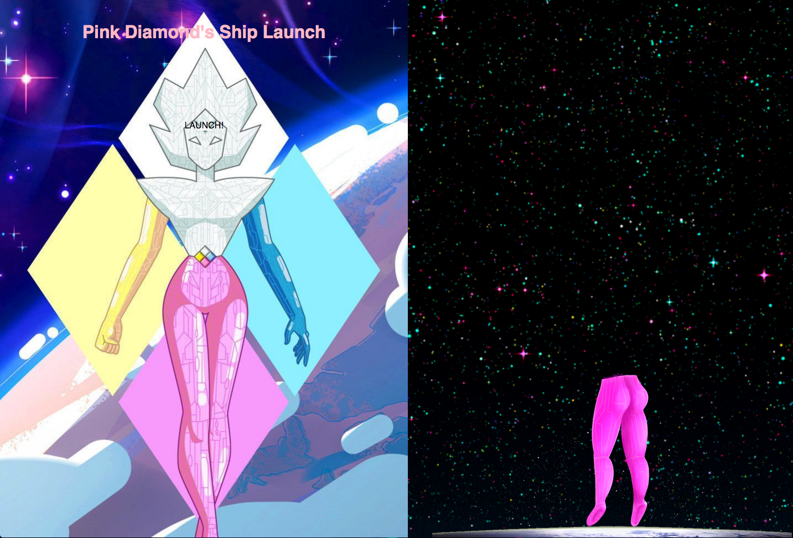

# Launching a Rocket using JavaScript

> This is a project to simulate a rocket launch.

In this project, there is a countdown, when it reaches to zero, there is a 50% possibilities that the rocket takes off, and 50% that it crashes, have fun!

## Built With

- HTML CSS and JavaScript

## Live Demo

[Live Demo Link](https://sunnysparks.github.io/js-rocket/)

## Getting Started

**Just click on the "Launch" sign, and watch for the countown to start, once it reaches zero you will see at your right if the rocket blasted off or if it exploded.**

## Author

👤 **José Francisco Silva Díaz**

- Github: [@SunnySparks](https://github.com/SunnySparks)
- Twitter: [@JosFranT6](https://twitter.com/JosFranT6)
- Linkedin: [linkedin](https://www.linkedin.com/in/josé-francisco-silva-díaz-a2a9421a6)

## 🤝 Contributing

Contributions, issues and feature requests are welcome!

## Show your support

Give a ⭐️ if you like this project!

## 📝 License

This project has no license
